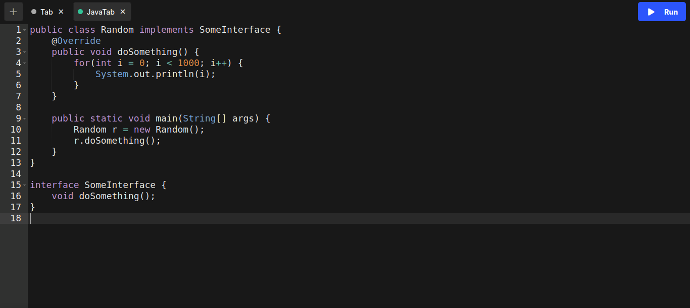
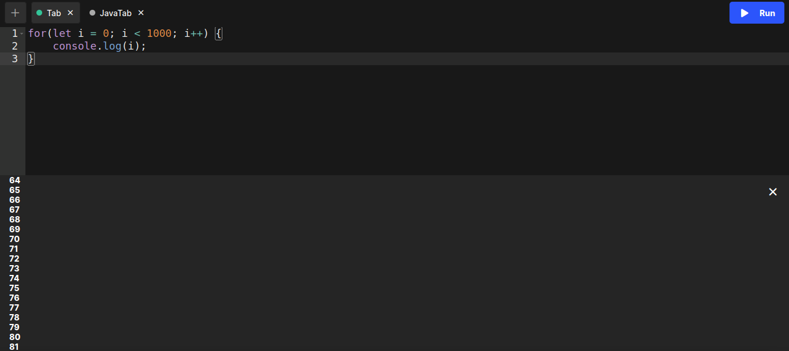

## Borealys Editor

Try it out live! [here](https://glazzes.github.io/code-editor/)

### About
This one is a simple code editor for my [borealys code runner](https://github.com/Glazzes/borealys) where you can write some code in the following 5 languages:
- Java
- JavaScript
- Python
- Go
- Bash

### How to build
 // TODO